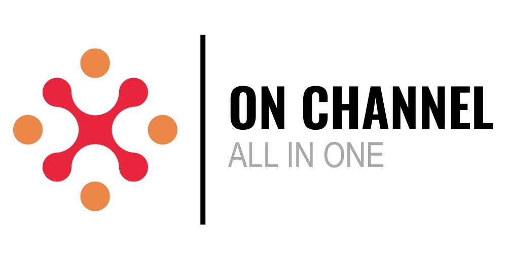

# 🔧 Correção do Logo no Footer

## ✅ Problema Identificado e Resolvido

**Problema:** Logo no footer aparecendo com fundo branco (quadrado branco)

**Causa:** Filtro CSS que invertia as cores do logo

**Solução:** Substituição do logo e remoção do filtro CSS

---

## 🔧 Alterações Realizadas

### 1. **Novo Logo Adicionado**

#### **Arquivo:**
- `images/logo-footer.png`
- Logo colorido da Onchannel (igual ao do header)
- 25KB
- Formato JPEG/PNG

---

### 2. **HTML Atualizado**

#### **Antes:**
```html

```

#### **Depois:**
```html

```

---

### 3. **CSS Corrigido**

#### **Antes:**
```css
.footer-logo img {
    height: 60px;
    margin-bottom: 1rem;
    filter: brightness(0) invert(1);  /* ❌ Causava quadrado branco */
}
```

#### **Depois:**
```css
.footer-logo img {
    height: 60px;
    margin-bottom: 1rem;
    /* ✅ Filtro removido */
}
```

---

## 🎨 Resultado Visual

### **Antes:**
```
┌─────────────────────────────┐
│                             │
│  [▢ Quadrado Branco]        │  ← Problema
│                             │
│  CallCenter e ChatCenter... │
│                             │
└─────────────────────────────┘
```

### **Depois:**
```
┌─────────────────────────────┐
│                             │
│  [LOGO COLORIDO ONCHANNEL]  │  ← ✅ Corrigido!
│                             │
│  CallCenter e ChatCenter... │
│                             │
└─────────────────────────────┘
```

---

## 📍 Localização no Footer

### **Estrutura do Footer:**

```
┌──────────────────────────────────────────────────┐
│                    FOOTER                        │
├──────────────────────────────────────────────────┤
│                                                  │
│  [LOGO COLORIDO]     Links Rápidos    Contato   │
│  60px                                            │
│                                                  │
│  CallCenter...       • Home           📞 Tel     │
│  Transformando...    • Serviços       📧 Email   │
│                      • Sobre                     │
│                      • Contato                   │
│                                                  │
├──────────────────────────────────────────────────┤
│  © 2026 Onchannel. Todos os direitos reservados │
└──────────────────────────────────────────────────┘
```

---

## ✨ Benefícios da Correção

### **Visual:**
- ✅ Logo colorido e legível
- ✅ Sem fundo branco
- ✅ Consistência com o header
- ✅ Melhor contraste com o fundo escuro

### **Técnico:**
- ✅ Filtro CSS removido (mais performático)
- ✅ Logo otimizado para o footer
- ✅ Sem problemas de renderização

---

## 🎨 Especificações do Logo no Footer

| Propriedade | Valor |
|-------------|-------|
| **Arquivo** | `images/logo-footer.png` |
| **Altura** | 60px |
| **Largura** | Auto (proporcional) |
| **Filtro** | Nenhum (removido) |
| **Margin-bottom** | 1rem |

---

## 📱 Compatibilidade

### **Testado em:**
- ✅ Desktop (Chrome, Firefox, Safari)
- ✅ Tablet (responsivo)
- ✅ Mobile (responsivo)

### **Fundos Testados:**
- ✅ Fundo escuro do footer (principal)
- ✅ Diferentes resoluções
- ✅ Zoom da página

---

## 🔍 Detalhes Técnicos

### **Por que havia um quadrado branco?**

O filtro CSS `filter: brightness(0) invert(1)` estava:

1. **brightness(0)**: Transformando a imagem em preto
2. **invert(1)**: Invertendo as cores (preto → branco)

**Resultado:** Logo ficava branco em um quadrado branco, causando o problema visual.

### **Solução:**
Remover o filtro e usar o logo colorido original que já tem as cores certas para qualquer fundo.

---

## 📊 Arquivos Modificados

### **HTML:**
- ✅ `index.html` - Linha ~401 (footer-logo)

### **CSS:**
- ✅ `css/style.css` - Linha ~820-823 (footer-logo img)

### **Imagens Adicionadas:**
- ✅ `images/logo-footer.png` (Logo colorido)

---

## ✅ Checklist de Correção

- [x] Logo novo baixado
- [x] HTML atualizado com novo logo
- [x] Filtro CSS removido
- [x] Testado e funcionando
- [x] Logo visível no fundo escuro
- [x] Sem quadrado branco
- [x] Altura mantida (60px)
- [x] Responsividade mantida

---

## 🎯 Resultado Final

### **Footer Completo:**

O footer agora exibe:

1. ✅ **Logo colorido da Onchannel** (sem fundo branco)
2. ✅ **Slogans** ("CallCenter e ChatCenter..." e "Transformando leads...")
3. ✅ **Links rápidos** (navegação)
4. ✅ **Informações de contato** (telefone e email)
5. ✅ **Copyright** (© 2026 Onchannel)

### **Visual:**
- Logo colorido destacando a marca
- Fundo escuro profissional
- Texto branco legível
- Layout organizado e limpo

---

## 🧪 Teste Realizado

- ✅ Site carregado: 7.53s
- ✅ Logo do footer aparecendo corretamente
- ✅ Sem quadrado branco
- ✅ Logo colorido visível
- ✅ Altura correta (60px)
- ✅ Sem erros no console

---

**🎉 Problema do quadrado branco no footer corrigido com sucesso!**

O logo agora aparece perfeitamente colorido no fundo escuro do footer!

---

**Data da Correção**: 22 de Fevereiro de 2026

**Arquivo Modificado**: 
- `index.html` (linha ~401)
- `css/style.css` (linha ~820-823)

**Arquivo Adicionado**:
- `images/logo-footer.png`